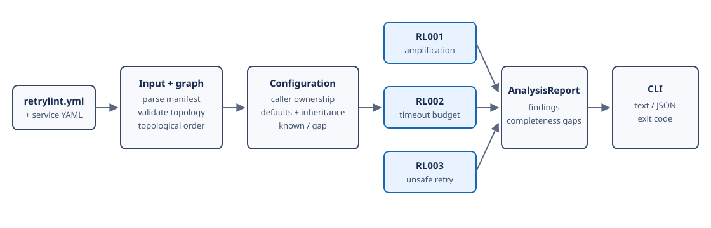

# Architecture

RetryLint is a normal Kotlin/JVM command-line application. Spring is present only in the Week 8 testbed services; it is not part of the analyzer.

## Processing pipeline

1. `TopologyManifestParser` reads `retrylint.yml` into small manifest declarations.
2. `TopologyValidator` checks identifiers, references, roots, relative configuration paths, and acyclicity, then builds deterministic lookup and adjacency maps in `ValidatedTopology`.
3. `ProjectConfigurationResolver` loads each declared service's `application.yml` through Jackson's YAML tree model. It resolves the supported Resilience4j subset into `ResolvedProjectConfiguration`; call policies belong to the caller service.
4. `RetryLintAnalyzer` invokes RL001, RL002, and RL003 independently and merges their findings and completeness gaps in a stable order.
5. `AnalysisReportRenderer` emits text or JSON. The CLI applies the selected failure threshold to choose its exit code.

The [algorithms guide](ALGORITHMS.md) defines each rule. The [frozen contract](CORE_CONTRACT_V0.1.md) is authoritative when this overview is less specific.

## Package responsibilities

| Package | Responsibility |
|---|---|
| `retrylint.input` | Defines the manifest schema, bounded YAML parsing, project loading, and input/path limits. |
| `retrylint.graph` | Validates topology and constructs operation/call maps, outgoing edges, topological order, and concrete cycle diagnostics. |
| `retrylint.config` | Parses durations and resolves the supported Retry/TimeLimiter defaults, inheritance, aliases, and unsupported semantics. |
| `retrylint.model` | Holds shared resolved-policy, finding, severity, and completeness-gap value types. |
| `retrylint.rules` | Implements retry amplification, retry-window arithmetic, timeout-budget checks, and unsafe-retry checks. |
| `retrylint.analysis` | Orchestrates project loading and all rules into one deterministic `AnalysisReport`. |
| `retrylint.report` | Serializes that report as stable text or JSON. |
| `retrylint.cli` | Defines `validate` and `analyze`, user options, diagnostics, and process exit behavior. |

## Design boundaries

The topology manifest owns architectural facts: services, operations, calls, roots, thresholds, and declared idempotency. Service YAML owns local policy facts. Validation rejects malformed topology before rule execution. Configuration resolution records timing as known, unknown, or unsupported, so a later rule cannot silently turn absent knowledge into a zero.

Determinism is deliberate: manifest order feeds linked maps and adjacency lists, topological traversal has a stable order, equal RL001 candidates retain the first encountered path, and final reports use explicit sort keys. Limits in the frozen contract bound input size, YAML aliases, inheritance depth, path length, and RL002 adjacent-pair work.

## Repository boundaries

- `retrylint-cli/` contains the frozen analyzer and its tests.
- `testbed-service/` and `testbed/` contain the four-service runtime validation system.
- `evaluation/week9/` contains the reviewed mutation corpus and results.
- `evaluation/week10/` contains the scalability method and recorded results.
- `docs/` explains the system and traces claims to those artifacts.
