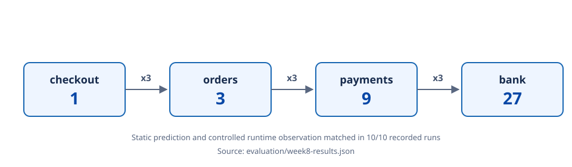
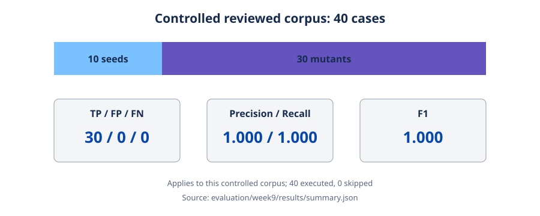
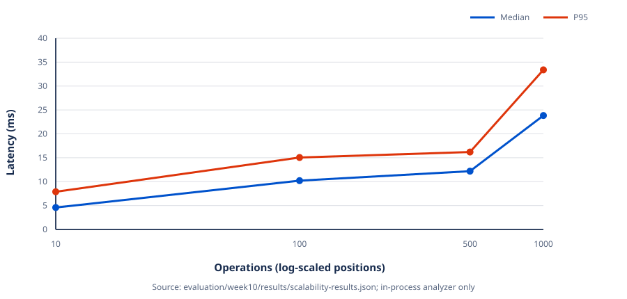

# Evaluation

This page summarizes the three completed evaluations. Primary machine-readable evidence is linked in every section; the [evidence index](EVIDENCE_INDEX.md) provides the claim-level map.

## Results summary

| Evaluation | Main recorded result | Scope and source |
|---|---|---|
| Week 8: runtime validation | Static 27x prediction; runtime counters `1 -> 3 -> 9 -> 27` in each of 10 repetitions | Controlled four-service failure experiment; [raw JSON](../evaluation/week8-results.json) |
| Week 9: detection evaluation | 40/40 cases executed; TP=30, FP=0, FN=0; precision=recall=F1=1.000 | Controlled reviewed mutation corpus; [summary JSON](../evaluation/week9/results/summary.json) and [per-case JSON](../evaluation/week9/results/raw-results.json) |
| Week 10: scalability | All 10/100/500/1000-operation sparse DAGs completed with zero findings and gaps | One in-process environment; [raw timing JSON](../evaluation/week10/results/scalability-results.json) |

## Week 8: runtime validation



The experiment runs real Spring Boot services with real Resilience4j Retry in Docker Compose:

```text
checkout -> orders -> payments -> bank
```

The analyzer's **static prediction** is an invocation envelope: checkout 1, then three attempts at every call boundary, producing orders 3, payments 9, and bank 27. The runtime system uses a deterministic persistent bank failure, trace IDs, and per-service counters. The verification script resets state between repetitions and compares observations with that prediction. Where applicable, the runtime mounts the same scenario configuration files that RetryLint analyzes.

The checked-in result records 10 independent repetitions of the 27x scenario. Every row reports checkout=1, orders=3, payments=9, bank=27, and `PASS`; the aggregate result is `PASS`. These observations validate this controlled configuration and failure mode, not all production scheduling or failure behavior. Method and commands are in the [testbed guide](../testbed/README.md); the immutable recorded counts are in [`week8-results.json`](../evaluation/week8-results.json).

## Week 9: mutation benchmark



The corpus comprises 10 safe seeds plus 30 manually reviewed mutants, for 40 indexed cases. Each `truth.json` identifies its parent seed, mutation operators, expected input status, expected findings and gaps, rationale, and review marker. Mutants store only their overlay differences. Review checked topology/configuration validity, retry multiplication, adjacent timeout arithmetic, target idempotency, and expected completeness independently of RetryLint output.

The scoring unit is:

```text
(ruleId, severity, ordered callPath, targetOperation)
```

- A true positive (TP) is an expected supported event found exactly.
- A false positive (FP) is an unexpected supported event.
- A false negative (FN) is an expected supported event not found.
- Invalid and partially analyzable inputs are counted separately; a correct rejection and a completeness gap are not findings.

```text
Precision = TP / (TP + FP)
Recall    = TP / (TP + FN)
F1        = 2 x Precision x Recall / (Precision + Recall)
```

All 40 cases executed and none were skipped. The recorded classifications are 34 valid/full, 3 invalid/rejected, and 3 partial. Overall TP=30, FP=0, and FN=0, giving precision, recall, and F1 of 1.000. Per-rule true positives are RL001=9, RL002=8, and RL003=13, with no false results. These metrics describe only this controlled reviewed corpus; they do not establish perfect accuracy on arbitrary systems. Sources: [summary JSON](../evaluation/week9/results/summary.json), [all per-case results](../evaluation/week9/results/raw-results.json), and the [benchmark methodology](../evaluation/week9/README.md).

### Local-only baseline

The comparison baseline independently reads service IDs/configuration paths and parses each service's supported local Retry/TimeLimiter subset. It can report malformed local configuration and supported-contract limitations such as exponential or randomized wait. It intentionally has no call/operation topology, so it cannot multiply retries across services, compare adjacent cross-service timeout budgets, or combine retries with target idempotency. It recorded 3 local issues and no architecture-level finding by design. This fairly compares the information available locally with the information available after adding topology; it is not a claim about features promised by Resilience4j.

## Week 10: scalability



The generator creates deterministic, connected sparse DAGs at four sizes. Each has four services, one root, a forward chain, and at most one additional fixed-seed forward edge per eligible operation, yielding `2N - 3` calls. Policies are deliberately safe: one attempt, zero wait, one-second TimeLimiter, and idempotent operations. Every case therefore expects zero findings and zero completeness gaps.

The measured boundary is one in-process `RetryLintAnalyzer.analyze(Path)` call. It includes manifest/service YAML parsing, topology validation, configuration resolution, and RL001/RL002/RL003. It excludes generation, Gradle, JVM/process startup, CLI parsing, rendering, and correctness assertions. Each size uses 3 excluded warm-ups followed by 20 retained measurements; there is no outlier removal. Median averages the middle pair and p95 uses nearest rank.

The table below is transcribed from the current [raw JSON evidence](../evaluation/week10/results/scalability-results.json); latency is milliseconds.

| Operations | Calls | Median | Mean | P95 | Maximum | Result |
|---:|---:|---:|---:|---:|---:|---|
| 10 | 17 | 4.590 | 5.032 | 7.889 | 8.352 | success |
| 100 | 197 | 10.213 | 10.935 | 15.053 | 17.655 | success |
| 500 | 997 | 12.192 | 12.876 | 16.201 | 17.533 | success |
| 1000 | 1997 | 23.834 | 25.234 | 33.389 | 34.423 | success |

All four cases report zero observed findings and gaps. The measured environment used Microsoft OpenJDK 21.0.12.1 on Windows/amd64; full environment fields, seeds, raw nanoseconds, manifest hashes, and correctness checks are in the JSON. Timing varies with machine, JVM, JIT, GC, and scheduling. Observed scaling was consistent with practical processing of the tested sparse DAGs, but four empirical points do not prove a Big-O bound or production-scale behavior. See the [Week 10 methodology](../evaluation/week10/README.md).

## Figure reproduction

The three quantitative figures above are generated from the linked JSON, not manually entered measurements. Run `powershell -ExecutionPolicy Bypass -File docs/scripts/generate-figures.ps1` from the repository root. Figure provenance is also embedded in each SVG and listed in [`figures/README.md`](figures/README.md).
